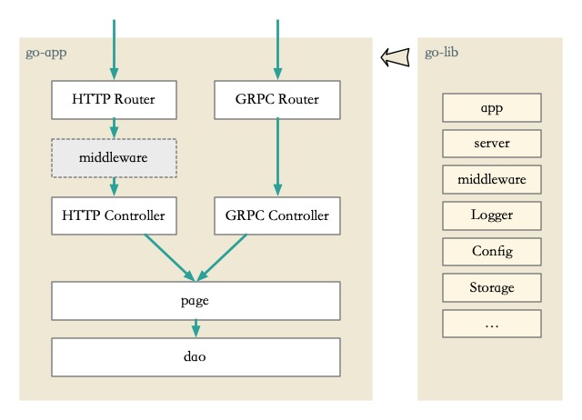
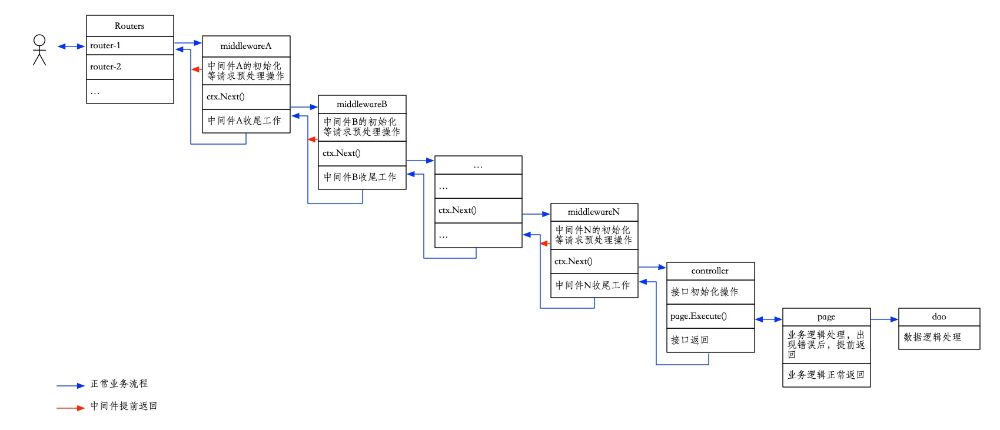
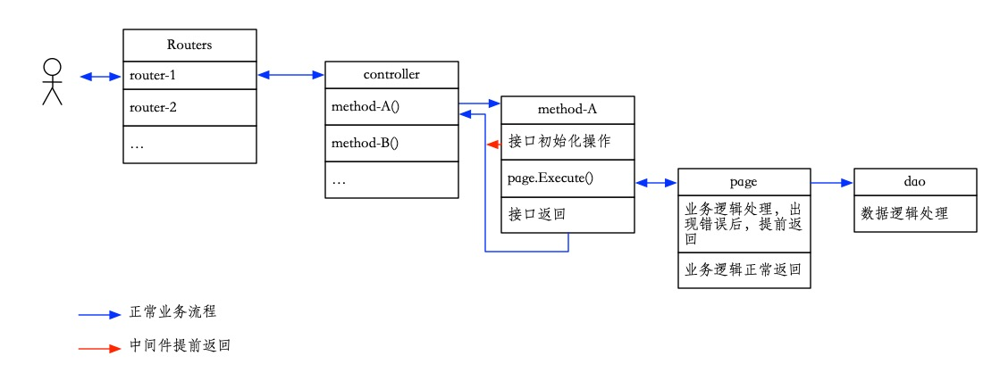
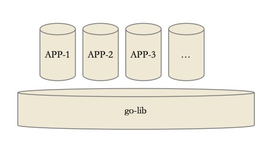
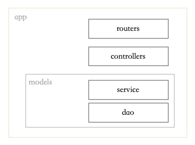
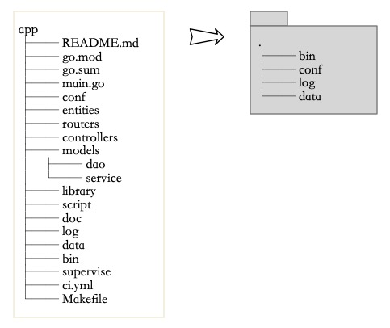

代码是写给人看的，理论上讲，我们不期望把代码规范定的太死，任何人都可以按照自己的习惯进行编码，但是当这种现象如果放大到一个项目、团队、组织中来看，就会导致后人维护代码成本过高等诸多问题。所以，我们制定了本开发指南，以期能在一个项目、团队、组织中达成统一的共识，形成一个统一的风格。

## 1 编码规范

### 1.1 总规范

todo::...

注：参考 Golang 官方文档：

+ [Effective Go](https://golang.org/doc/effective_go)
+ [Effective Go 中文版](https://github.com/bingohuang/effective-go-zh-en)

### 1.2 代码格式化

+ 使用 goimports 工具进行代码格式化。

注：较之于 gofmt，goimports 会额外修正 import 代码块

### 1.3 命名

+ 变量、函数、结构体、结构体方法、文件的命名应尽量有意义，对于一些明显的拼写错误，发现后，应及时修正。

### 1.4 模块化

+ 对于可以抽象为 1 个函数/方法的相同逻辑，抽象为 1 个函数/方法；
+ 对于不可以抽象为 1 个函数/方法的逻辑块，用 1 个空行与其他代码逻辑块分开；
+ 对于逻辑相似的 N 个函数/方法，建议考虑通过函数生成器的方式抽象为 1 个函数/方法。

### 1.5 返回值

+ 除去约定的入口函数/方法，其他的函数/方法须有一个 error 返回。

### 1.6 错误的判断

+ 优先判断错误逻辑，并提前返回，正常的代码放在后面，对正常代码保持最少的缩进。

注：这也是 Golang 的设计思想之一

### 1.7 接口请求

+ 字段名风格统一为：小写字母 + 下划线；

示例：

```
POST {{host}}/demo/foobar
Content-Type: application/json

{
    "order_id": 27149
}
```

### 1.8 接口返回

+ 返回的 json 格式数据，字段风格统一为：小写字母 + 下划线;
+ 返回的 json 格式数据，外层固定为：code、message、data 字段，code 为 0 表示正常，message 为 code 的描述信息，data 为接口返回的实际数据；
+ 对于表示列表的字段，字段名建议加上 _list 后缀；
+ 对于表示对象的字段，字段名建议加上 _info 后缀。

示例：

```
{
    "code": 0,
    "message": "ok",
    "data": {
        "user_info": {
            "id": "5",
            "name": "旺仔"
        },
        "user_list": [
            {
                "id": "5",
                "name": "旺仔"
            },
            {
                "id": "7",
                "name": "旺旺"
            }
        ]
    }
}
```

## 2 web app 目录结构及开发说明

```
app
├── README.md
├── go.mod
├── go.sum
├── main.go
├── conf
├── entities
│   ├── entitydemo
│   ├── grpc_protos
│   ├── pb
│   └── protocoder.sh
├── routers
│   ├── grpc.go
│   └── http.go
├── controllers
│   ├── grpc
│   └── http
├── models
│   ├── dao
│   │   └── common_config.go
│   └── service
│       └── pagedemo
├── library
│   ├── middlewares
│   └── utils
├── script
├── doc
├── log
├── data
├── bin
├── supervise
├── ci.yml
└── Makefile
```

请求发起后，整体流程如下：



对于 http 请求，细节如下：



对于 grpc 请求，细节如下：



下面逐一对各个目录/文件进行说明。

### main.go

作为 Golang 程序的主入口文件，示例如下：

```
func main() {
    app.Init()
    app.RegisterServer(server.NewHTTPServer(routers.HTTPRouter))
    app.RegisterServer(server.NewGRPCServer(routers.GRPCRouter))
    app.Run()
}
```

+ `app.Init()`: 初始化配置文件等信息
+ `app.RegisterServer`: 注册需要的服务，目前可自由组合使用的有：http、grpc
+ `app.Run()`: 启动服务

为了便于说明，下面以同时使用 http 和 grpc 服务提供查询 gituser 信息为例。

### conf

为 web app 的配置文件目录，示例如下：

```
conf
├── apollo.toml
├── app.toml
├── cache.toml
└── db.toml
```

其中 app.toml 为 web app 主配置，内容如下：

```
use_apollo = false

################################################################################
# 当 use_apollo 为 false 时，将使用 conf 目录中配置文件的配置，包括本文件
app_name = "yawebapp"
app_env = "dev"

db_driver = "mysql"
cache_driver = "redis"
```

配置中的第一项，当 `use_apollo` 选项开启后，web app 会自动请求 appollo.toml 中指定的 apollo 服务以获取需要的配置信息（配置key命名规范待约定）。当 `use_apollo` 选项关闭后，web app 则使用该 conf 目录下的对应配置文件以获取需要的配置信息。

### entities

接口的请求、响应参数在这里进行集中定义和管理。示例如下：

```
entities
├── entitydemo
│   └── gituser.go
├── grpc_protos
│   └── foobar.proto
├── pb
│   └── foobar.pb.go
└── protocoder.sh
```

对于 http 接口，以 `GET /demo/gituser` 为例，上面新建了 entitydemo/gituser.go 文件，内容如下：

```
// ReqGitUser 请求参数定义结构体
type ReqGitUser struct {
    Name string `form:"name" binding:"required"`
}

// ResGitUser 请求响应定义结构体
type ResGitUser struct {
    Info string `json:"words"`
}
```

+ `ReqGitUser` 结构体成员 Name 后的 `from` tag 用于绑定请求的实际参数名，而 `form` tag 本身表明了请求的参数格式为常见的 from 格式。对于 application/json 格式的请求，则使用 `json` tag。其他可使用的 tag 参见[gin 官方文档](https://github.com/gin-gonic/gin#only-bind-query-string)。
+ `ReqGitUser` 结构体成员 Name 后的 `binding` tag 用于约定该参数的属性，具体可用属性参见[gin 官方文档](https://github.com/gin-gonic/gin#model-binding-and-validation)。

对于 grpc 请求，定义的 protobuf 文件统一位于 grpc_protos 目录，protocoder.sh 脚本会扫描 grpc_protos 目录里 `.proto` 后缀文件，生成的代码位于 pb 目录。这里的 grpc_protos/foobar.proto 文件内容如下：

```
syntax = "proto3"; // 版本声明，使用Protocol Buffers v3版本

option go_package = "entity/pb"; // full import path of the Go package
// option java_package = "com.example.foobar";
// option php_metadata_namespace = "Protobuf\\Example\\Foobar";

package pb; // 包名


// 定义我们的服务（可定义多个服务,每个服务可定义多个接口）
service Foobar {
    rpc index(RequestGitUser) returns (ResponseGitUser);
}

// 定义请求参数，采用驼峰命名方式，小写加下划线，如：student_name
message RequestGitUser {
    // [repeated] 参数类型 参数名 = 标识号(不可重复);
    string name = 1;
}

// 定义响应的参数::外层标准结构
message ResponseGitUser {
    // [repeated] 参数类型 参数名 = 标识号(不可重复);
    int32 code = 1;              // 状态码
    string message = 2;          // 状态信息
    ResponseGitUserData data = 3;  // 响应数据
}

// 定义响应的参数::内层数据
message ResponseGitUserData {
    // [repeated] 参数类型 参数名 = 标识号(不可重复);
    string info  = 1;
}
```

需要注意的是，为了满足我们的接口返回约定，对于响应参数的定义，这里使用了两层的结构。最后使用 protocoder.sh 脚本生成的 Golang 代码为 pb/foobar.pb.go，查看代码文件，有我们需要实现的服务接口定义：

```
// FoobarServer is the server API for Foobar service.
type FoobarServer interface {
    Index(context.Context, *RequestGitUser) (*ResponseGitUser, error)
}
```

这里，我们将对该服务接口的实现约定为 grpc 服务控制器，放在 controllers 章节描述。在实现后，需要调用该服务的注册方法：

```
func RegisterFoobarServer(s *grpc.Server, srv FoobarServer) {
    s.RegisterService(&_Foobar_serviceDesc, srv)
}
```

将实现的 grpc 服务控制器注册到 grpc server 中，对于这部分我们约定为路由注册，放在 routers 章节描述。

注：[Language Guide (proto3)](https://developers.google.com/protocol-buffers/docs/proto3)

### routers

分为 http.go 和 grpc.go 两部分，http.go 用于定义 http 请求路由，grpc.go 用于定义 grpc 请求路由。

http 请求路由示例如下：

```
func HTTPRouter() {
    httpServer := app.GetHTTPServer()
    httpServer.NoRoute(middlewares.RouterNotFound)

    // 路由组
    DemoGr := httpServer.Group("/demo")
    {
        DemoGr.GET("/gituser", demo.GitUser)
    }
}
```

通过 `app.GetHTTPServer()` 获取 `*gin.Engine` 以使用 gin 框架的路由能力。具体路由配置及中间件使用可以参考 [gin 官方文档](https://github.com/gin-gonic/gin#api-examples)。上面的代码中，

+ `httpServer.NoRoute(middlewares.RouterNotFound)` 注册 `RouterNotFound` 中间件，对于不存在的接口请求，该中间件会给出统一的错误返回；
+ `httpServer.Group("/demo")` 定义了以 `/demo` 为请求路径前缀的 API 接口路由组；
    - `DemoGr.GET("/gituser", demo.GitUser)` 最终确定将 `GET /demo/gituser` 请求路由到 `demo.GitUser` 控制器方法，方法实现参见 controllers 章节。

grpc 请求路由示例如下：

```
func GRPCRouter() {
    grpcServer := app.GetGRPCServer()

    // 为 Foobar 服务注册业务实现 将 Foobar 服务绑定到 RPC 服务容器上
    pb.RegisterFoobarServer(grpcServer, &grpc.Foobar{})
}
```

通过 `app.GetGRPCServer()` 获取 `*grpc.Server` 以使用 grpc 能力。上面的代码中，

+ `pb.RegisterFoobarServer(grpcServer, &grpc.Foobar{})` 根据 protobuf 生成的 `pb.RegisterFoobarServer` 方法将业务实现的 `grpc.Foobar` 服务控制器注册到 `grpcServer`；
+ `pb.RegisterFoobarServer` 方法的生成参见 entities 章节；
+ `grpc.Foobar` 服务控制器的实现参见 controllers 章节。

注：[A basic tutorial introduction to gRPC in Go](https://grpc.io/docs/languages/go/basics/)

### controllers

分为 http 和 grpc 两个目录，示例如下：

```
controllers
├── grpc
│   └── foobar.go
└── http
    └── demo
        └── gituser.go
```

对于 http 请求控制器方法统一放在 http 目录，为了方便管理，这里可根据路由组建立对应的子目录。我们的示例接口控制器方法文件为 http/demo/gituser.go，内容如下：

```
// GitUser -
func GitUser(ctx *gin.Context) {
    appContext := server.NewWebContext(ctx)
    response := server.NewHTTPResponse()

    // 业务逻辑请求参数初始化
    reqEntity := entitydemo.ReqGitUser{}
    resEntity := entitydemo.ResGitUser{}

    // 请求参数解析
    err := appContext.ShouldBind(&reqEntity)
    if err != nil {
        // 错误提前返回
        response.Error(appContext, err)
        return
    }

    // 执行业务逻辑
    err = pagedemo.NewGitUserPage(appContext).Execute(reqEntity, &resEntity)
    if err != nil {
        // 错误提前返回
        response.Error(appContext, err)
        return
    }

    // 正常返回
    response.Success(appContext, resEntity)
}
```

对于 grpc 服务控制器统一放在 grpc 目录，grpc/foobar.go 为我们的示例，内容如下：

```
// Foobar 定义服务
type Foobar struct{}

// Index 实现 Index 方法
func (s *Foobar) Index(ctx context.Context, req *pb.RequestGitUser) (*pb.ResponseGitUser, error) {
    appContext := server.NewWebContext(nil)
    response := server.NewGRPCResponse(&pb.ResponseGitUser{})

    // 业务逻辑请求参数初始化
    reqEntity := entitydemo.ReqGitUser{}
    resEntity := entitydemo.ResGitUser{}

    // 请求参数解析
    err := appContext.ShouldBindGRPC(req, &reqEntity)
    if err != nil {
        // 错误提前返回
        response.Error(appContext, err)
        return response.PB().(*pb.ResponseGitUser), nil
    }

    // 执行业务逻辑
    err = pagedemo.NewGitUserPage(appContext).Execute(reqEntity, &resEntity)
    if err != nil {
        // 错误提前返回
        response.Error(appContext, err)
        return response.PB().(*pb.ResponseGitUser), nil
    }

    // 正常返回
    response.Success(appContext, resEntity)
    return response.PB().(*pb.ResponseGitUser), nil
}
```

可以看出，对于 http 和 grpc 的控制器方法内部逻辑，我们的流程如出一辙：

1. 初始化 `appContext` 和 `repsonse`；
2. 初始化业务请求、响应参数变量；
3. 执行请求参数解析、绑定；
4. 复用同一个底层 page service 执行业务逻辑；
5. 输出正常返回。

### models/service

我们约定，所以的业务逻辑代码，统一放置于该目录，可以需要进行目录划分，目录格式约定为：page{xxxx}。我们的示例为：

```
models/service
└── pagedemo
    └── gituserpage.go
```

models/service/pagedemo/gituserpage.go 文件内容如下：

```
type GitUserPage struct {
    ctx *server.WebContext
}

func NewGitUserPage(ctx *server.WebContext) *GitUserPage {
    return &GitUserPage{ctx: ctx}
}

func (s *GitUserPage) Execute(req entitydemo.ReqGitUser, res *entitydemo.ResGitUser) error {
    var data dao.CommonConfig
    result := app.DB().First(&data, "name = ?", req.Name)
    if result.Error == nil {
        j, _ := json.Marshal(data)
        res.Info = fmt.Sprintf("你好：%v", string(j))
        return nil
    }
    if result.Error != gorm.ErrRecordNotFound {
        return fmt.Errorf("查询数据出错：%v", result.Error.Error())
    }
    return result.Error
}
```

可以看出，文件名约定格式为：{xxxx}page.go，为文件内定义的 struct 名小写。`New{xxxx}` 和 `Execute` 方法为约定的固定方法，会在 controller 层进行调用。可以增加其他辅助方法用于满足业务逻辑的实现。

### models/dao

我们约定，所有的数据库 model 统一放置于该目录。我们的示例为：

```
models/dao
└── common_config.go
```

models/dao/common_config.go 文件内容如下：

```
type CommonConfig struct {
    ID       int64     `json:"id" gorm:"primaryKey"`
    Name     string    `json:"name"`
    CreateAt time.Time `json:"create_at"`
    UpdateAt time.Time `json:"update_at"`
}

func (m *CommonConfig) TableName() string {
    return "common_config"
}
```

通过 `TableName` 方法关联到对应的数据库表。这里的 struct 定义细节，可以参考[模型定义](https://gorm.io/zh_CN/docs/models.html)。

### library

在业务逻辑实现过程中，如有通用的功能（如业务错误码的定义等），都可放置于该目录，可以根据需要进行目录划分，示例如下：

```
library
├── common
│   └── error_code.go
├── middlewares
└── utils
```

关于错误码的定义，可以参考示例文件 library/common/error_code.go：

```
var (
    ErrorNotExist = errors.New("[100021] 数据不存在")
)
```

错误码约定为 Golang 中的 error 类型，通过 `errors.New` 方法定义，内容格式约定为：[error_code] error_message。

### script

脚本文件归类在该目录，如定时任务等，细节待定。

todo::...

### doc

项目文档归类在该目录。

## 3 web app go-lib 目录结构及开发说明

我们抽象出 go-lib 代码库，为 web app 提供底层基础设施服务。目录结构如下：

```
go-lib
├── app
│   ├── apollo.go
│   ├── app.go
│   ├── app_conf.go
│   ├── app_error.go
│   ├── cache.go
│   ├── db.go
│   ├── env.go
│   └── init.d.go
├── config
│   ├── agollo.go
│   └── conf.go
├── middlewares
│   └── router_not_found.go
├── server
│   ├── Engine.go
│   ├── grpc_response.go
│   ├── http_response.go
│   ├── regexes.go
│   ├── regexes_test.go
│   ├── server_grpc.go
│   ├── server_http.go
│   └── webcontext.go
├── storage
│   ├── cache_file.go
│   ├── cache_redis.go
│   ├── db_mysql.go
│   └── db_sqlite.go
└── utils
    └── file_helper.go
```

下面逐一说明。

### app

为了便于 web app 的业务逻辑开发，该目录下提供了一些基础的全局变量/方法：

+ 方法 `Apollo() *apollo` 返回 apollo 实例，可以调用对应的 `Get(key string, opts ...GetOption) string` 方法获取 apollo 中 key 的配置数据；
+ 变量 `ErrorNone` 和 `ErrorParam` 为内置错误码，分别表示 正常 和 参数错误；
+ 方法 `Name() string` 返回 web app 名；
+ 方法 `Init()`、`RegisterServer(s server.ServerI)` 和 `Run()` 参考 web app main.go 章节使用示例；
+ 方法 `GetHTTPServer() *gin.Engine` 和 `GetGRPCServer() *grpc.Server` 参考 web app routers 章节使用示例；
+ 方法 `Cache() *cache` 返回 cache 实例，内部接入 go-redis 的接口能力，进行缓存的设置；
+ 方法 `DB(clusterNames ...string) *db` 返回 db 实例，内部接入 gorm 的接口能力，进行数据库操作；
+ 方法 `RootPath() string`、`BinPath() string`、`ConfPath() string`、`LogPath() string`、`DataPath() string` 分别返回对应的目录；

### config

todo::...

### middlewares

目前提供的中间件能力有：

+ `RouterNotFound` 参考 web app routers 章节中的使用示例；


### server

todo::...

### storage

todo::...

### utils

提供了一些通用的工具类，目前有：

+ file_helper.go 与文件/目录相关的通用操作方法；

## 4 业务层框架规范说明

业务层框架规范的目的主要是为了规范化业务分层、逻辑拆分、接口约定、模块的目录/命名结构，以及部署同构这一系列应用开发、部署过程中所面临的问题。以期在一个项目、团队、组织中达成统一的风格共识，一方面可以加速新项目的研发效率、避免重复踩雷，一方面可以降低新同学的上手成本，另一方面也可以降低项目接手成本。

### 4.1 名词解释

+ 业务层: 在具体 web 框架之上进行的业务逻辑开发的部分。
+ 业务层框架: 主要是把业务逻辑开发过程中一些共性的部分抽取出来建立的框架。这部分包含控制器组件，通用业务组件（参数处理、打日志、异常处理等），配置组件，日志组件等等。
+ 业务层规范: 侧重于具体业务/应用开发过程中需要处理的诸如：如何分层，层次之间接口如何约定，部署环境，以及业务/应用内部的目录，命名组织等。

### 4.2 设计目标

梳理业务层规范主要会把如下方面的问题解决，以及固化下来：

+ 一个应用/模块会包含哪几部分
    - 分别对应哪个目录
    - 目录的命名以及组织规范
+ 一个具体功能/页面逻辑应当被拆分为哪几个层次
    - 不同层次的逻辑划分准则
    - 不同层次之间的关系
    - 层次之间的接口规范
+ 命名规范
    - 类名
    - url
+ 应用/模块的线上部署规范

### 4.3 整体概述



#### 4.3.1 逻辑层次规范



一个应用的逻辑拆分准则如图所示，分为 controller、service、dao 这几个层次。其中 service、dao 这两层实际上是对 MVC 模式中 model 的再度细分。

##### 4.3.1.1 dao

dao，Data Access Object 的简称，也有说法为 ORM。通常来说，dao 层对应于具体的，无逻辑的数据操作。例如对于数据库来说，一个 dao 文件通常对应于具体一张表（如果涉及到分表，则对应于一组表）及表上的增删改查操作（如果有的话，依赖于 ORM 实现方式）。

在 dao 层，我们做以下约定：

+ 严禁同层调用；
+ struct 命名规范：与表名相关联，例如表 common_config 对应为 CommonConfig；
+ 文件为：models/dao/{xxxx}.go，例如 models/dao/common_config.go

##### 4.3.1.1 service

service 层主要做具体的业务逻辑，通常做的工作为：

+ 具体页面逻辑的组织
+ 组合 dao 数据
+ 数据校验（合法性，有效性）
+ 安全性校验

通常来说，一个 controller 建议对应于一个 service。但是一个 service 可以被多个 controller 调用（比如 http 的 controller 和 grpc 的 controller）。

在 service 层，我们做以下约定：

+ struct 命名规范：{xxx}Page，例如 GitUserPage；
+ 文件为：models/service/page{xxx}/{yyy}page.go，例如 models/service/pagedemo/gituserpage.go；
+ 由于 service 和 controller 对应关系，所以 service 的名字也应和 controller 能够对应起来，如 controllers/http/demo/gituser.go，对应的 service 就是 models/service/pagedemo/gituserpage.go；
+ 对外接口形式：service 只暴露两个接口，`New{xxx}Page(ctx *server.WebContext) *{xxx}Page` 和 `Execute(req entity{xxx}.Req{yyy}, res *entity{xxx}.Res{yyy}) error` 接口，如 `NewGitUserPage(ctx *server.WebContext) *GitUserPage`、`Execute(req entitydemo.ReqGitUser, res *entitydemo.ResGitUser) error`。

##### 4.3.1.1 controller

controller 是整个业务层次中唯一跟路由控制器有数据流通、产生耦合的一层。通常一个 API 接口路由对应到一个具体 controller，主要做的工作如下：

+ 解析参数
+ 跟具体页面相关的权限判断等逻辑(通常为判断这个页面用户是否登录，等级等)
+ 调用对应的 service 接口（通常为 Excute 方法）
+ 渲染接口返回数据

注意，在 controller 层，我们尽量不包含业务逻辑，仅仅能做一些具体页面相关的逻辑。

在 controller 层，我们做以下约定：

+ 命名规范：与 api 接口请求路径名相关联，例如 `GET /demo/gituser` 方法名为 GitUser；
+ 文件为：与 api 接口请求路径名相关联，例如 `GET /demo/gituser` 的文件为 controllers/http/demo/gituser.go。

### 4.4 编译产出规范



如图所示，web app 项目中的以下目录/文件:

+ ci.yml
+ Makefile
+ bin/appctl
+ bin/start.sh
+ bin/stop.sh
+ supervise

为打包、编译、服务启动及服务状态监控等脚本文件，默认提供。代码提交、编译通过后，下载 tar.gz 包，解压完成后，目录结构如下:

```
output
├── bin
│   ├── demo
│   ├── start.sh
│   ├── stop.sh
│   └── appctl
├── conf
├── log
├── data
└── supervise
```

其中 output/bin/demo 为 web app 项目编译之后的二进制可执行文件。

### 4.5 部署规范

将 4.4 章节中的 tar.gz 包解压到对应的服务器目录即可，这里我们约定为：/data/soft/app/{xxx}，例如 /data/soft/app/demo。


